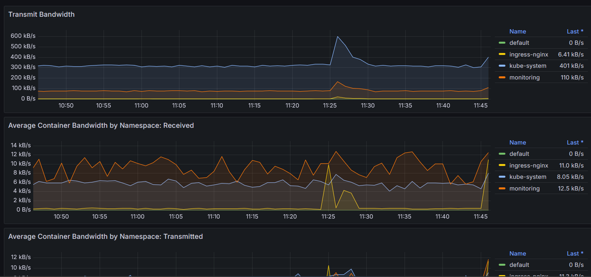

# Создание облачной инфраструктуры

## 1. Сервисный аккаунт и bucket

В Яндекс Облаке при помощи Terraform создал сервис-аккаунт и назначил необходимые права


а так-же создал bucket на 1ГБ


В дальнейшем сгенерил terraform-key.json сервисного аккаунта, который буду использовать для аутентификации при подготовке инфраструктуры.

[Terraform код](terraform/service_account)

## 2. Инфраструктура

В Яндекс Облаке при помощи Terraform было поднято 

VPC c подсетями public и private


5 виртуальных машин

Одна виртуальная машина (master) в зоне public

Три виртуальных машины (worker) в зоне private

Одна виртуальная машина (nat-instance) в зоне public

Начальная конфигурация операционной системы на разных виртуальных машинах проходила через индивидуальный cloud-init


Так-же была создана таблица маршрутов из private на nat-instance для получения трафика виртуальным машинам в зоне private


Был создан Network Load Balancer и listener с targetport:30080


В target-group добавил worker-nodes


После применения кода, файл ```terraform.tfstate улетает``` в созданный ранее bucket


[Terraform код](terraform/main_infrastructure)

# Создание Kubernetes кластера

## Кластер

Kubernetes кластер подготавливал при помощи Kubespray, который запускал с master-node

```git clone https://github.com/kubernetes-sigs/kubespray.git```

Поставил зависимости

```pip install -r ~/kubespray/requirements.txt```

В файле с переменными ```~/kubespray/inventory/mycluster/group_vars/k8s_cluster/k8s-cluster.yml``` в параметре ```supplementary_addresses_in_ssl_keys``` подкинул nat-ip master-node

Заполняем inventory.ini

Одна мастер-нода, три воркер-ноды


Ожидание составило почти 15 минут


После раскатки роли обновил ```~/.kube/config``` на master-node и на локальной машине

А так-же для ingress поставил ingress-nginx через helm

```# helm repo add ingress-nginx https://kubernetes.github.io/ingress-nginx```

```# helm repo update```

При конфигурации ingress-nginx указал порт 30080, такой-же как и на listener у балансировщика в ЯО

```# helm upgrade --install ingress-nginx ingress-nginx/ingress-nginx --namespace ingress-nginx --create-namespace --set controller.service.type=NodePort --set controller.service.nodePorts.http=30080 --set controller.progressDeadlineSeconds=30```

Команда kubectl get pods --all-namespaces отрабатывает без ошибок


# Создание тестового приложения

Собрал docker образ тестового приложения и поместил его в DockerHub


[Ссылка на DockerHub](https://hub.docker.com/repository/docker/vyacheslavgaidar/diploma_app/general)

Docker файл с тестовой страницей html и nginx.conf лежат в репозитории.

[Ссылка на репозиторий](https://github.com/gaidarvu/test_app_k8s)

# Подготовка cистемы мониторинга и деплой приложения

Клонирую репозиторий с заранее подготовленными конфигами для мониторинга и моего тестового приложения

[Мой репозиторий с конфигами](https://github.com/gaidarvu/k8s_cfgs)

```git clone https://github.com/gaidarvu/k8s_cfgs.git```

## Grafana, prometheus, alertmanager, экспортер основных метрик Kubernetes

Систему мониторинга поднимал через helm

```# helm repo add prometheus-community https://prometheus-community.github.io/helm-charts```

```# helm repo update```

Запускаем установку с конфигом из склонированного ранее репозитория

```# helm upgrade --install kube-prometheus prometheus-community/kube-prometheus-stack --namespace monitoring --create-namespace -f ~/k8s_cfgs/kube-prom-values.yaml```

Gragana доступна по адресу http://158.160.172.134/grafana




## Тестовое приложение

Запускаем манифест из склонированного ранее репозитория

```kubectl apply -f app_all_in_one.yml```

Тестовое приложение доступно по адресу http://158.160.172.134/app


## CI/CD-terraform

Создал workflow в GitHub Actions, который при любом пуше в main запускает пайплайн

[Сам Workflow](https://github.com/gaidarvu/diploma/blob/main/.github/workflows/terraform.yml) 

Как видно пайплайн прошел успешно


Workflow прошел за две с половиной минуты


Workflow, который протекает уже на поднятой инфраструктуре ничего не поменял и прошел успешно


А тут решил добавить оперативки nat-инстансу

Workflow прошел успешно


Как видим vm остановилась


И поднялась уже с 2ГБ оперативки


# Установка и настройка CI/CD

В репозитории с тестовым приложением создал workflow в GitHub Actions, который при любом пуше в main запускает пайплайн где собирает образ приложения и отправляет его в DockerHub

А так-же если пуш происходит с тегом, приложение деплоится в кубернетес кластер

[Workflow](https://github.com/gaidarvu/test_app_k8s/blob/main/.github/workflows/deploy.yaml)

[Репозиторий с тестовым приложением](https://github.com/gaidarvu/test_app_k8s)

# Демонстрация работы

Внес изменения в репозитории и сделал пуш без тага


Как видим запустился пайплайн


Который завершился успешно, но не попал в деплой


Теперь внес изменения в репозитории и сделал пуш с тагом

Для наглядности внес изменение в страничку со статичными данными. Записал туда версию приложения, которую укажу в таге: 1.0.17


Как видим пайплайн прошел успешно и приложение задеплоилось в кластер


Смотрим какой образ использовался для деплоя


Web-интерфейс. Версия поменялась


В DockerHub залетел образ с тагом


